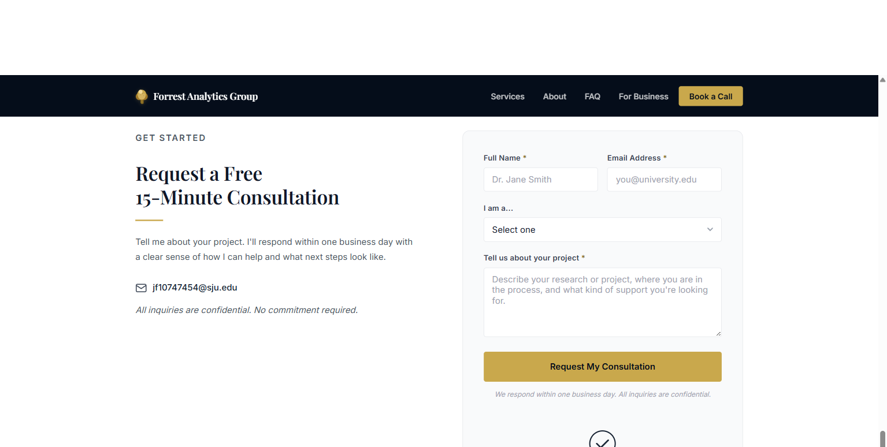
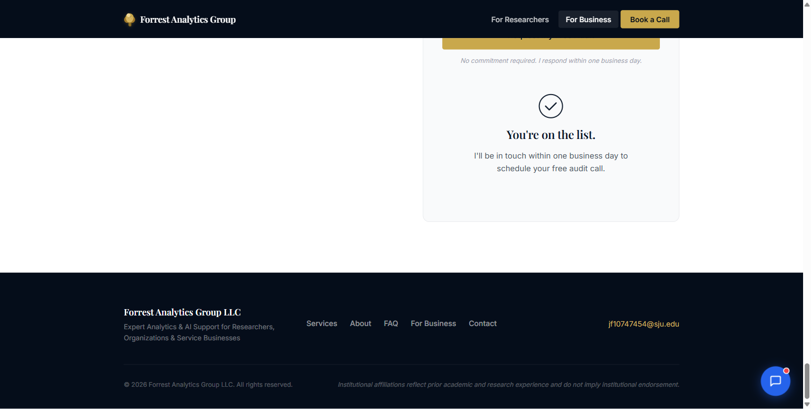
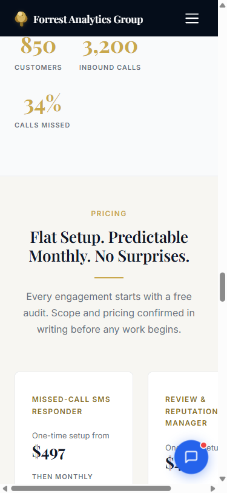
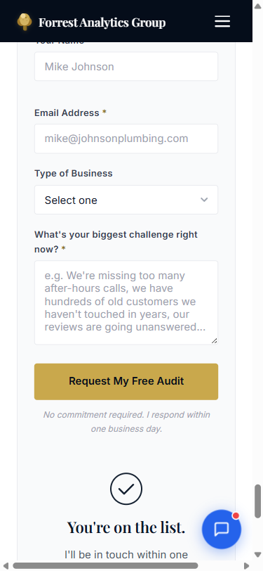
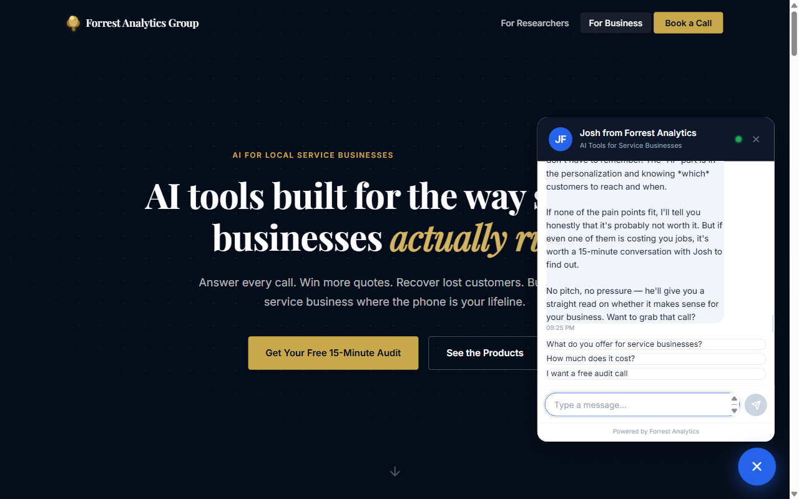
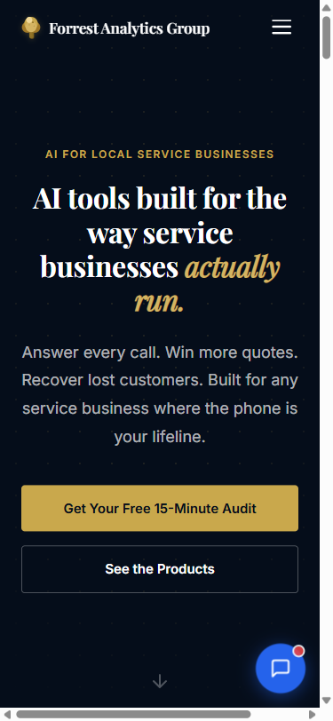

# Website Audit: forrestintelligence.com/small-business/
**Audited:** April 10, 2026 | **Auditor:** Claude Code (Playwright browser audit)

---

## 1. Executive Summary — Top 5 Most Impactful Fixes

Ranked by conversion impact. Fix these before anything else.

| # | Issue | Impact |
|---|-------|--------|
| 1 | **"Book a Call" nav links to the researcher contact form** — a plumber clicking that button sees "Dr. Jane Smith" and "you@university.edu" as placeholder text. Active conversion killer. | 🔴 Critical |
| 2 | **Footer email is `jf10747454@sju.edu`** — a student institutional email on a business site destroys credibility instantly. | 🔴 Critical |
| 3 | **Zero real client testimonials** — the only social proof is credentials and a synthetic dataset. No one's paying $197/mo based on your M.S. alone. | 🔴 Critical |
| 4 | **Mobile pricing section overflows horizontally** — `.pricing-grid` is 441px on a 375px viewport, causing a horizontal scrollbar that breaks the pricing experience on every phone. | 🔴 Critical |
| 5 | **The "Keystone Plumbing" case study isn't clearly marked as synthetic on the main page** — copy says "designed and tested against a representative plumbing operation" but a prospect naturally reads this as a real client. When they click through and see "CASE STUDY · SAMPLE BUILD — all synthetic," trust craters. | 🟠 High |

---

## 2. What's Working Well

These are genuine strengths. Don't touch them.

**Hero Section:** Passes the 5-second test. "AI tools built for the way service businesses *actually run.*" is confident, specific, and speaks to the skepticism your audience has about generic tech solutions. The italic gold italic emphasis is a strong visual hook.

**The Chatbot is your best sales tool.** More on this in Section 9, but it's genuinely exceptional — qualifying questions, ROI framing, honest objection handling, and lead capture in a single flow. The chatbot outperforms the page itself in several ways.

**Industry grid (Plumbing, HVAC, Roofing, etc.)** immediately tells a plumber "this is for me." It's fast, scannable, and removes the "but does this apply to my industry?" objection within 3 seconds.

**Pricing headline:** "Flat Setup. Predictable Monthly. No Surprises." is strong — it directly addresses the anxiety service business owners have about hidden fees and vendor lock-in. The "confirmed in writing before any work begins" line underneath is excellent.

**"How Many Calls Did Your Shop Miss Last Month?"** — The contact form headline is the best copy on the page. It triggers self-reflection, and most owners genuinely don't know the answer. Smart hook.

**Product card copy is clean and concrete.** Each card leads with a real outcome, not a feature. "When your phone goes unanswered, they get a personal text in 30 seconds — before they dial your competitor" is excellent. No jargon.

**Product detail pages (e.g., Missed-Call SMS Responder)** are well-structured with a clear problem → mechanism → outcome flow. The stat "85% of callers who reach voicemail do not leave a message" adds credibility.

**"Audit. Build. Run." section** reduces the complexity fear. Three steps, plain English, no implementation anxiety. This is exactly the reassurance this audience needs.

**Bundle pricing** is well-positioned — the "BEST VALUE" badge, the visual contrast (dark card), and the "Save $290/month vs. buying individually" line are all conversion-positive.

**Form placeholder text ("Mike Johnson", "mike@johnsonplumbing.com")** is a small but excellent touch. It signals immediately that this form is built for people like them.

---

## 3. Critical Issues — Fix Immediately

### 3.1 "Book a Call" Goes to the Researcher Contact Form



**What happens:** A service business owner sees "Book a Call" in the nav (the most prominent conversion CTA in your header) and clicks it. They land on `/research/#contact` — a form titled "Request a Free 15-Minute **Consultation**" with placeholder text "Dr. Jane Smith" and "you@university.edu" and a dropdown asking "I am a…" designed for academics.

**Why this is catastrophic:** This is your primary nav CTA. On cold email outreach campaigns, many people will click the site, look around, and if they're interested, instinctively hit "Book a Call." You're sending them somewhere that actively signals they're in the wrong place.

**The fix:** Either:
- (Best) Point "Book a Call" to a Calendly / Cal.com link for a direct 15-minute booking so they can self-schedule without waiting for you to follow up
- (Acceptable) Point it to `#sb-contact` on the small-business page so it anchors to the audit request form
- Do NOT point it to the researcher page under any circumstances

---

### 3.2 Footer Email: `jf10747454@sju.edu`



This is a student ID email address displayed as the contact for a business charging $497 setup fees. It signals:
- You're a student, not a business owner
- You're using institutional infrastructure you don't control
- The email will stop working when you graduate

**The fix:** Replace with either a custom domain email (`josh@forrestintelligence.com`) via Google Workspace ($6/mo) or, at minimum, a branded Gmail. Update everywhere it appears (footer, research page contact form, any email automations).

---

### 3.3 No Real Client Testimonials

The page has zero quotes from paying customers. The social proof that exists:
- SJU instructor credential ✓
- M.S. BI&A credential ✓
- Wharton Executive Education client work ✓
- Keystone Plumbing "case study" (synthetic data) — not clear it's synthetic on the main page ✗

For a service business owner deciding whether to spend $497 + $197/mo, credentials aren't enough. They want to know: *Did it work for someone like me?*

**The fix (short-term):** If you have no paying clients yet, add a section with 2–3 beta testers or early adopters you gave free/discounted access in exchange for a testimonial. Even one real quote from "Mike, Johnson's Plumbing, Philadelphia" beats all your credentials combined.

**The fix (ongoing):** After every client audit call — even if they don't buy — ask if they'd share a sentence about the call. Build this habit now.

---

### 3.4 Mobile Pricing Section Overflow



**What's broken:** On 375px (iPhone SE, most Android), the `.pricing-section` renders at 441px — 66px wider than the viewport — causing a horizontal scrollbar. The pricing grid shows two columns at mobile width, making each card ~170px wide with cramped text, and the chatbot button overlaps the right card's content.

**The cause:** `.pricing-grid` uses a two-column CSS grid that doesn't collapse to single-column below ~440px.

**The fix:** Add a CSS media query (or Squarespace mobile style override) to make `.pricing-grid` single-column at ≤480px:
```css
@media (max-width: 480px) {
  .pricing-grid {
    grid-template-columns: 1fr;
  }
}
```

---

## 4. High-Priority Improvements — Fix This Week

### 4.1 Keystone Plumbing is Synthetic — The Main Page Doesn't Say That

**Main page copy:** "Every product in this suite was designed and tested against a representative plumbing operation, 850 customers, 2,400 jobs, 3,200 inbound calls. The data told us exactly where the money was walking out the door."

**Case study page copy:** "CASE STUDY · SAMPLE BUILD — Keystone Plumbing & Drain is a representative sample business used to design, configure, and validate every AI product in this suite. 850 customers, 2,400 jobs, 420 reviews — all synthetic, all realistic, all actionable."

The main page implies a real business relationship. The case study reveals it's synthetic. This is a trust mismatch that works against you — a prospect who clicks the case study link expecting proof will feel misled.

**The fix:** Update the main page copy to be upfront:
> **Current:** "Every product in this suite was designed and tested against a representative plumbing operation, 850 customers, 2,400 jobs, 3,200 inbound calls."
> **Suggested:** "Every product was designed and stress-tested against a synthetic-but-realistic plumbing dataset — 850 customers, 2,400 jobs, 3,200 calls — built to reflect how service businesses actually operate."

This is more honest and still impressive. It also prevents the trust damage from clicking through.

---

### 4.2 No OG Tags — Social Sharing Is Broken

The page has no `og:title`, `og:description`, or `og:image` meta tags. When anyone shares your URL on LinkedIn, Facebook, or iMessage, it renders with either a blank card or Squarespace's default branding.

**The fix:** In Squarespace > Pages > Small Business > SEO, add:
- **og:title:** "AI Tools for Service Businesses | Forrest Intelligence"
- **og:description:** "Stop losing jobs to missed calls, ignored reviews, and unbooked estimates. 5 AI tools built specifically for plumbers, HVAC, roofers, and service businesses."
- **og:image:** A custom 1200×630px image (your hero section as a graphic, or a simple branded card)

---

### 4.3 "Talk to Josh Directly" CTA Is Misleading

The "Talk to Josh Directly" button in the "Why Work With Us" section scrolls to the audit request form. A user reading the section about your credentials and clicking "Talk to Josh Directly" expects a direct line — a phone number, email, or at minimum a chat option. Landing on a form that takes a business day to respond feels like a bait-and-switch.

**The fix:** Either rename the CTA to "Request a Free Audit" (honest), or better: make it open the chatbot, since the chatbot actually delivers an instant conversation.

---

### 4.4 Product Detail Pages Name-Drop "Claude" — Jargon for Your Audience

On the Missed-Call SMS product page, Step 2 in the how-it-works flow reads: "**Claude Writes the Text** — Within 30 seconds, Claude composes a personalized SMS in your voice."

A plumber does not know who Claude is. To them this reads as a person named Claude or gibberish. "Claude" as a brand name is irrelevant to their decision — what matters is that the message sounds personal and arrives fast.

**The fix:** Replace "Claude Writes the Text" with "AI Writes the Text" or "A Personalized Message Is Drafted." The *outcome* is what matters, not the underlying model.

---

### 4.5 No Phone Number Anywhere on the Site

Service business owners are phone people. They call their suppliers, their subs, their customers. Hiding behind a form with a one-business-day response time creates friction for the segment most likely to buy from you.

**The fix:** Add a phone number (even a Google Voice number) to the footer and the contact section. Even the text "Prefer to call? (215) 555-XXXX" would reduce friction significantly.

---

### 4.6 No Calendly — "Book a Call" Requires Waiting

Every conversion path on your site ends with "fill out a form and Josh will reach out within one business day." There is no self-scheduling option. For a prospect who's ready to talk now, this is a cold shower.

**The fix:** Set up a free Calendly (or Cal.com) and:
1. Link "Book a Call" in the nav directly to your Calendly
2. Add a Calendly embed option to the contact form section as an alternative to the form
3. Have the chatbot offer the Calendly link when someone says "I want to book a call" instead of collecting info manually

---

## 5. Medium-Priority Improvements — Fix This Month

### 5.1 "Why Work With Us" Headline Talks About You, Not Them

**Current:** "I Don't Just Build AI. I Teach It."

This is clever but self-referential. Your audience doesn't care that you teach AI — they care what that means for their business. The teaching credential should be *translated into a customer benefit*, not stated as a standalone claim.

**Suggested:** "The Tools Are Built on Real Data. Not Demos."
Or: "Built by Someone Who Has to Defend Every Number."

Then open the body copy with the teaching credential as the *reason why* — not the headline itself.

---

### 5.2 The Wharton/Aramco/Apple Credential Confuses Your Audience

The credential card reads: "Client Work: Wharton Executive Education — Analytics for Aramco, T-Mobile, Apple programs."

For a plumber or HVAC owner, this is more confusing than reassuring. The gap between "analytics for Apple" and "SMS responder for my plumbing company" is so large it raises the question: *Why is this person selling me this?*

**The fix:** Replace with something that resonates with your actual customer:
> **"Built on the same data-first approach I use to help Fortune 500 teams. Now applied to the problems service businesses actually face."**

Or simply remove the Wharton card and replace it with your first real client testimonial.

---

### 5.3 The "Built For" Industry Grid Is Decorative — Make It Work

The industry grid (Plumbing, HVAC, Lawn Care, etc.) is visually useful but functionally inert. None of the tiles are clickable. A plumber clicking "Plumbing" could land on a plumbing-specific version of the page or at least a section that says "Here's what 34% missed calls means for a plumbing business specifically."

**The fix (minimum):** Make each tile link to the appropriate section of the product page or case study.
**The fix (best):** Create a "for plumbers" variant of the key sections — even just a headline swap with industry-specific copy in a modal or tabbed view.

---

### 5.4 No FAQ on the Small-Business Page

The footer navigation includes "FAQ" but it links to the homepage anchor (`/#faq`), not to a small-business-specific FAQ. Common questions your prospects have (and your chatbot already handles well) deserve to live on the page:

- "What do I need to set this up?"
- "Do I need to change my phone system?"
- "What happens if I want to cancel?"
- "How long until it's live?"
- "Is there a contract?"

Add a 5–6 question FAQ section before the contact form. It reduces the barrier to submitting the form and answers objections passively for the 70% of visitors who never open the chatbot.

---

### 5.5 Contact Section Has a Layout Issue on Mobile



The left column (copy/headline) and right column (form) stack correctly on mobile, but the left column is empty in the viewport before you scroll — just whitespace. On mobile, the form headline and body copy should come first, immediately followed by the fields.

---

### 5.6 The Products Section Has an Odd Ordering

The product cards appear in this order: Missed-Call SMS, Review Manager, Customer Re-Engagement, Estimate Follow-Up, AI Website Chatbot.

This is neither price-ordered, impact-ordered, nor adoption-ladder-ordered. The chatbot ($297 setup) is the lowest-risk entry point but is buried last. Suggest reordering by likely prospect priority:

1. Missed-Call SMS Responder (most universal pain)
2. Estimate Follow-Up Automation (immediate revenue recovery)
3. Review & Reputation Manager (trust signal)
4. Customer Re-Engagement Engine (longer-term play)
5. AI Website Chatbot (infrastructure investment)

---

## 6. Low-Priority / Nice-to-Haves

- **Add a photo of Josh** somewhere on the small-business page. The "Why Work With Us" section talks about Josh in first person but shows credential cards, not a face. Real people buy from real people.
- **The trust strip / credentials section** between the hero and the industry grid (referenced in the page structure) was not visible in desktop screenshots — confirm it's rendering. It should show above the fold on desktop.
- **Page load** feels fast on desktop (Squarespace CDN), but consider lazy-loading the chatbot widget script, as it fires immediately on page load.
- **Footer navigation** links (Services, About, FAQ) go to homepage anchors (`/#services`, `/#about`, `/#faq`) — these are the *researcher-side* sections of the homepage. From the small-business page, they could create confusion. Consider a small-business-specific footer or removing those links from this page's footer.
- **No schema markup** detected (LocalBusiness, Service, FAQPage) — low effort, decent SEO benefit.
- **The "Scroll down" arrow** on the hero points to `#trust-strip` but the credential strip renders so close to the hero that it's easy to miss. Consider animating or making the scroll destination more visually distinct.

---

## 7. Copy Rewrites

Only sections where the copy is actively weak or misleading. Everything else is fine.

---

### 7.1 Case Study Framing on Main Page

**Current:**
> "Every product in this suite was designed and tested against a representative plumbing operation, 850 customers, 2,400 jobs, 3,200 inbound calls. The data told us exactly where the money was walking out the door. See what we found and how each tool addresses it."

**Problem:** Implies a real client. Case study page says synthetic.

**Suggested:**
> "Every product in this suite was built against a realistic synthetic plumbing dataset — 850 customers, 2,400 jobs, 3,200 inbound calls — specifically designed to reflect how service businesses actually operate. Here's what the data showed, and how each tool responds to it."

---

### 7.2 "Why Work With Us" Headline

**Current:** "I Don't Just Build AI. I Teach It."

**Problem:** Self-referential. Doesn't land a customer benefit.

**Suggested:** "These Tools Were Built to Pass the Same Test I Give My Students: Does the Data Actually Back It Up?"

Or simpler: "Built by Someone Who Can't Afford to Guess."

---

### 7.3 Hero Sub-headline

**Current:** "Answer every call. Win more quotes. Recover lost customers. Built for any service business where the phone is your lifeline."

**Problem:** It's good but slightly generic. "The phone is your lifeline" is a metaphor — it's not as concrete as your other copy.

**Suggested:** "Stop losing jobs to missed calls, dead estimates, and customers who just needed a reason to come back."

This is outcome-specific and reads like you're describing their current pain, not your product features.

---

### 7.4 "Talk to Josh Directly" CTA

**Current:** Button label: "Talk to Josh Directly" → links to audit form

**Problem:** "Directly" implies immediate contact. A form that takes one business day is not direct.

**Suggested:** Rename to "Request a Free Audit" or "Start the Conversation" — or wire it to open the chatbot instead.

---

### 7.5 Pricing Sub-headline

**Current:** "Every engagement starts with a free audit. Scope and pricing confirmed in writing before any work begins."

**This is already good.** Keep it exactly as-is. Don't change this.

---

## 8. Missing Elements

Things the site doesn't have that it should, ranked by impact:

| Missing | Why It Matters | Effort |
|---------|---------------|--------|
| **Real client testimonials (even 1)** | No credential compensates for zero customer proof | Quick once you have them |
| **Photo of Josh** | "Real person" trust signal; your copy is personal, your page is faceless | Quick fix |
| **Calendly / self-scheduling** | Every conversion path requires waiting for Josh to respond | Half day to set up + link |
| **Phone number** | Your audience calls; hiding behind a form loses them | Quick fix |
| **Satisfaction guarantee / cancellation policy** | "What if it doesn't work?" is the silent objection; addressing it proactively increases conversion | Half day to write + add |
| **FAQ section on small-business page** | 5–6 questions eliminate objections passively | Half day |
| **Before/after result examples** | Even one real-world result ("a landscaper recovered 3 missed calls in week 1") is worth 10 credentials | Ongoing |
| **OG/social sharing tags** | Broken for all social platforms right now | Quick fix in Squarespace SEO panel |
| **Number of clients served or businesses audited** | Social proof stat even if small ("14 businesses audited") builds confidence | Quick once you have it |
| **Demo video** | Seeing the SMS go out in real time is a powerful conversion tool; could be screen-recorded in 20 min | Half day |

---

## 9. Chatbot Review

**Overall Rating: Excellent. This is your best sales asset.**

The chatbot was tested with four real prospect questions. Here's what happened:

---

### Question 1: "What do you offer for plumbing companies?"

**Response quality:** ✅ Excellent

The bot named the most relevant tools for plumbers (missed-call SMS, estimate follow-up, review management) with plumbing-specific context. It correctly identified that plumbing is an urgent-need business where timing matters. It ended with a qualifying question: *"What's your current situation — are missed calls the main headache, or is something else costing you more right now?"* — which is exactly what a good salesperson would ask.

---

### Question 2: "How much does it cost?"


**Response quality:** ✅ Excellent

The bot gave accurate pricing (no hallucination — prices matched the site), framed it in ROI terms ("it pays for itself in the first recovered call of the month"), and clarified that setup fees cover Josh's configuration time ("you don't log into any software or learn anything new. It just runs."). Ended with: *"What's your average job value roughly? I can give you a more specific ROI picture based on your numbers."* — smart personalization hook.

---

### Question 3: "I'm not sure I need AI for my business"



**Response quality:** ✅ Outstanding — this is best-in-class objection handling

The bot said: *"If none of the pain points fit, I'll tell you honestly that it's probably not worth it. But if even one of them is costing you jobs, it's worth a 15-minute conversation with Josh to find out. No pitch, no pressure — he'll give you a straight read on whether it makes sense for your business."*

This is honest, non-pushy, and still moves toward a conversion. It mirrors what a trustworthy salesperson would say. No hallucinations, no overselling.

---

### Question 4: "I want to book a call"


**Response quality:** ⚠️ Good flow, but missing self-scheduling

The bot collected name, email, phone, and business name — good lead capture. It then said: *"Josh will reach out within one business day to lock in a time."*

**The problem:** There's no Calendly link or self-scheduling option. A prospect who's ready to book right now has to wait. Add a Calendly link here: *"Or if you'd prefer to pick a time yourself: [calendly.com/yourlink]"*

---

### Overall Chatbot Findings

| Dimension | Score | Notes |
|-----------|-------|-------|
| Opening hook | ✅ Strong | "No pitch, just honest answers" + qualifying question is excellent |
| Product knowledge | ✅ Accurate | No hallucinations; correct pricing throughout |
| Audience tone | ✅ Right voice | Speaks like a trusted advisor, not a bot |
| Objection handling | ✅ Outstanding | Honest, non-pushy, still converts |
| Lead capture | ⚠️ Late-funnel only | Only captures info at "I want to book" — misses drop-offs |
| Booking experience | ⚠️ Form dependency | No self-scheduling; adds a 1-day delay |
| Visual integration | ✅ Good | Widget sits naturally in bottom-right; doesn't intrude |

**One structural gap:** The chatbot doesn't ask for name/email until the "book a call" step. Anyone who chats for 3 messages and closes the widget leaves no contact info. Consider asking "What's your name and best email?" after the second qualifying exchange — so you capture partial leads even if they don't reach the booking stage.

---

## 10. Mobile Report

**Tested at:** 375×812px (iPhone SE / standard mobile)



### What Works on Mobile

- **Hero:** Clean, readable, CTAs stack full-width. The gold CTA button is thumb-friendly. ✅
- **Industry grid:** Renders correctly as 2-column grid. ✅
- **"How It Works" steps:** Stack single-column, readable. ✅
- **Contact form:** Single-column, fields are properly sized, button is full-width. ✅
- **Chatbot button:** Visible and accessible in bottom-right. ✅

### What Breaks on Mobile

**Critical — Pricing Section Overflow:**


The `.pricing-section` renders at 441px on a 375px viewport. This causes:
- Horizontal scrollbar across the entire page
- Second pricing card partially clipped off the right edge
- Chatbot button overlapping the right pricing card content
- User cannot see full pricing cards without horizontal scrolling

This affects every mobile visitor who scrolls to the pricing section — which is likely a significant portion of your traffic.

**Fix:**
```css
@media (max-width: 480px) {
  .pricing-grid {
    grid-template-columns: 1fr !important;
    width: 100% !important;
    overflow-x: hidden;
  }
  .pricing-section {
    overflow-x: hidden;
  }
}
```
In Squarespace, add this to Design > Custom CSS.

**Medium — Contact Section Layout:**

On mobile, the left column (audit pitch copy) appears before the form fields but occupies a lot of vertical space. The form itself doesn't appear until you scroll past the full copy block. Consider reducing the pitch copy on mobile to 2 sentences max so the form fields appear sooner.

**Low — Hamburger Menu Not Tested:**

The mobile nav shows a hamburger icon (☰). The nav links behind it (particularly "Book a Call") carry the same wrong destination issue described in Section 3.1 — fix the desktop link and it fixes mobile simultaneously.

---

## 11. Action Plan

Every change, ordered by impact, with effort estimate. **Fix items 1–6 before any cold email goes out.**

| # | Action | Impact | Effort |
|---|--------|--------|--------|
| 1 | Fix "Book a Call" nav link — point to Calendly or `#sb-contact` | 🔴 Critical | Quick fix |
| 2 | Replace `jf10747454@sju.edu` with `josh@forrestintelligence.com` in footer and all pages | 🔴 Critical | Quick fix |
| 3 | Fix mobile pricing overflow with CSS media query in Squarespace Custom CSS | 🔴 Critical | Quick fix |
| 4 | Update main page case study copy to say "synthetic dataset" explicitly | 🟠 High | Quick fix |
| 5 | Add OG tags (title, description, image) in Squarespace SEO panel | 🟠 High | Quick fix |
| 6 | Rename "Talk to Josh Directly" button to "Request a Free Audit" | 🟠 High | Quick fix |
| 7 | Set up Calendly and link from nav "Book a Call" + chatbot "book a call" response | 🟠 High | Half day |
| 8 | Remove "Claude Writes the Text" jargon from product detail pages; replace with "AI Writes the Text" | 🟠 High | Quick fix |
| 9 | Add a real photo of Josh to the "Why Work With Us" section | 🟡 Medium | Quick fix |
| 10 | Get 1–3 real testimonials (beta users, free audits, anyone) and add to the page | 🔴 Critical | Depends on outreach |
| 11 | Rewrite hero sub-headline (see Section 7.3) | 🟡 Medium | Quick fix |
| 12 | Rewrite "Why Work With Us" headline (see Section 7.2) | 🟡 Medium | Quick fix |
| 13 | Rewrite case study copy on main page (see Section 7.1) | 🟠 High | Quick fix |
| 14 | Add a phone number to footer and contact section | 🟠 High | Quick fix |
| 15 | Add 5-question FAQ section before the contact form | 🟡 Medium | Half day |
| 16 | Replace/reframe Wharton credential card with customer-relevant copy | 🟡 Medium | Quick fix |
| 17 | Update chatbot to ask for name/email earlier (after 2nd qualifying message, not only at booking) | 🟡 Medium | Half day |
| 18 | Make chatbot offer Calendly link when user says "I want to book a call" | 🟠 High | Quick fix once Calendly exists |
| 19 | Reorder product cards by prospect priority (see Section 5.6) | 🟡 Medium | Quick fix |
| 20 | Add schema markup: LocalBusiness, Service, FAQPage | 🟢 Low | Half day |
| 21 | Make industry tiles clickable (link to relevant sections) | 🟢 Low | Half day |
| 22 | Add a satisfaction guarantee / cancellation policy statement | 🟡 Medium | Half day |
| 23 | Record a 60-second screen-capture demo video of the SMS tool in action | 🟡 Medium | Half day |
| 24 | Audit footer nav links from small-business page (currently link to researcher-side homepage anchors) | 🟢 Low | Quick fix |
| 25 | Add canonical URL tag to small-business page in Squarespace SEO | 🟢 Low | Quick fix |

---

## Appendix: SEO Snapshot

| Field | Value | Assessment |
|-------|-------|------------|
| Page title | "AI Tools for Local Service Businesses \| Forrest Intelligence" | ✅ Good — keyword-rich |
| Meta description | "AI tools built for service businesses — missed-call SMS, review automation, estimate follow-up, and customer re-engagement. Designed by Josh Forrest, M.S. Business Intelligence & Analytics and Instructor of AI for Business at Saint Joseph's University." | ⚠️ Long and credential-heavy; should emphasize outcomes, not credentials |
| OG title | None | ❌ Missing |
| OG description | None | ❌ Missing |
| Canonical URL | None set | ⚠️ Should be added |
| H1 count | 1 ✅ | Clean |
| H2/H3 structure | Logical hierarchy ✅ | Good |
| Images missing alt text | 0 of 0 | Page uses SVG icons/CSS, no `` tags — no photos at all |
| Schema markup | None detected | ❌ Missing — add LocalBusiness + FAQPage |

*Audit completed April 10, 2026. Screenshots saved to `.playwright-mcp/` directory.*
